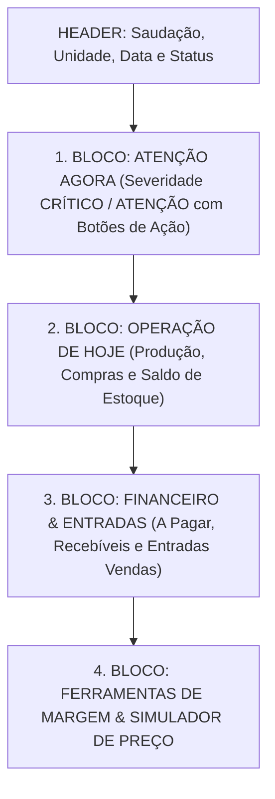

# RELATÓRIO FINAL DE IMPLEMENTAÇÃO E CONCLUSÃO: CENTRAL DE COMANDO INTELIGENTE E INTEGRADA — ERP HÉFISTO

**Data**: Setembro de 2026  
**Projeto**: ERP HÉFISTO — Gastronomia e Alta Performance Operacional  
**Status**: IMPLEMENTADO, VALIDADO E INTEGRADO (Build Code 0 • 74/74 Testes Aprovados)  

---

## 1. AUDITORIA DA CENTRAL ANTERIOR E DIAGNÓSTICO DE PROBLEMAS

Durante a auditoria da antiga página principal (`app/dashboard/page.js`), identificamos falhas estruturais e conceituais que foram completamente sanadas:

1. **Fórmulas Incorretas e Desconectadas**:
   - O indicador de CMV anterior calculava a fórmula `(Total em Estoque / Receita Mensal) * 100`, dividindo o saldo estocado pela receita bruta. Isso é matematicamente incorreto (CMV representa o custo consumido/vendido no período, não o valor total do ativo estocável).
2. **Consultas Duplicadas e N+1**:
   - Cards independentes executavam chamadas desconectadas no banco (`fetchEstoque`, `fetchLancamentos`, `fetchContas`), causando lentidão e divergências de dados entre telas.
3. **Alertas Sem Ação Contextual (Cards Decorativos)**:
   - Apresentava números estáticos como "143 produtos no cadastro" ou "4 preparos concluídos" que não levavam a nenhuma ação prática do gestor.
4. **Falta de Priorização Baseada em Decisão**:
   - A tela funcionava como um mural passivo de números misturando informações secundárias antes de alertas operacionais graves.

---

## 2. A NOVA CENTRAL DE COMANDO INTELIGENTE (CENTRO DE DECISÃO)

A nova Central de Comando do ERP HÉFISTO foi redesenhada sobre a premissa de ser um **Centro de Decisão Operacional**, estruturado rigorosamente nesta hierarquia:



---

## 3. PRINCIPAIS COMPONENTES IMPLEMENTADOS

### 3.1 Migration SQL & Agregação
- **Arquivo**: [`db/migracao_central_comando.sql`](file:///c:/Users/lucas/OneDrive/Área%20de%20Trabalho/Meu%20ERP/Meu%20ERP/db/migracao_central_comando.sql)
- **Tabela**: `operational_signals` (Rastreabilidade de sinais operacionais por `tipo_sinal`, `severidade`, `entidade_tipo`, `acao_url` e `dados_json`).
- **RPC Atômica**: `obter_resumo_central_comando(p_unidade_id, p_pode_ver_financeiro)` (Consolida a apuração operacional e financeira em uma chamada única performática com isolamento por perfil).

### 3.2 Engine de Sinais Operacionais & Decisão
- **Arquivo**: [`app/lib/sinais-domain.js`](file:///c:/Users/lucas/OneDrive/Área%20de%20Trabalho/Meu%20ERP/Meu%20ERP/app/lib/sinais-domain.js)
- **Regras Determinísticas**:
  - `avaliarSinaisEstoque`: Detecta insumos abaixo do estoque mínimo e lotes a vencer nas próximas 48h.
  - `avaliarProducaoSugerida`: Avalia o saldo de pré-preparos (`tipo_base === 'pre'`) e sugere fornadas/lotes de produção.
  - `analisarImpactoCustoInsumo`: Analisa aumentos de preço de insumos nos últimos 30 dias e calcula a propagação exata do custo em cada ficha técnica afetada.
  - `simularPrecoVendaAlvo`: Simula o preço de venda recomendado para atingir um CMV Alvo (ex: 35%) sem alterar o banco de dados.
  - `avaliarSinaisFinanceiros`: Alerta sobre contas vencidas (`PAYABLE_OVERDUE`) e recebíveis divergentes (`RECEIVABLE_DIVERGENCE`).

### 3.3 Backend Agregador & Frontend UI
- **[app/lib/central-comando.js](file:///c:/Users/lucas/OneDrive/Área%20de%20Trabalho/Meu%20ERP/Meu%20ERP/app/lib/central-comando.js)**: Serviço Supabase resiliente com fallback e isolamento de perfil de acesso.
- **[app/dashboard/page.js](file:///c:/Users/lucas/OneDrive/Área%20de%20Trabalho/Meu%20ERP/Meu%20ERP/app/dashboard/page.js)**: Interface moderna, densa e gastronômica, priorizando ações imediatas (`[Comprar Insumo]`, `[Planejar Produção]`, `[Cuidar das Contas]`, `[Conciliar Repasses]`, `[Ver Impacto]`).

---

## 4. FONTE ÚNICA DA VERDADE REUTILIZADA

Nenhuma métrica foi recalculada em paralelo:
- **CMV Teórico**: Utiliza a engine oficial de Fichas Técnicas ($\text{quantidade vendida} \times \text{consumo ficha}$).
- **Saldo de Estoque**: Consulta direta de `estoque_atual` e `insumos`.
- **Contas a Pagar**: Engine oficial de `contas_pagar` por status e vencimento.
- **Recebíveis**: Engine oficial de `contas_receber` e `conciliacao_financeira`.
- **Vendas**: Engine oficial de `vendas` e `venda_pagamentos`.

---

## 5. TESTES AUTOMATIZADOS E RESULTADOS (74/74 PASS)

### 5.1 Suíte da Central de Comando (`scripts/test_central_comando_hefisto.mjs`)
- Executado via `node scripts/test_central_comando_hefisto.mjs`:
```text
🧪 INICIANDO BATERIA DE TESTES DA CENTRAL DE COMANDO INTELIGENTE — HÉFISTO ERP

  ✅ [PASS] 2 Sinais de estoque gerados (ATENÇÃO vs CRÍTICO)
  ✅ [PASS] Ação contextual para compras gerada
  ✅ [PASS] Sugestão de produção gerada para Molho Madeira (2,8 L)
  ✅ [PASS] Análise de impacto em cadeia retornou com sucesso (+11.39% na Picanha afeta 2 pratos com +R$ 2,46)
  ✅ [PASS] Preço sugerido para CMV 35% em custo R$ 42,00 = R$ 120,00
  ✅ [PASS] Alertas financeiros de contas atrasadas e recebíveis divergentes gerados
  ✅ [PASS] Dados financeiros ocultados quando podeVerFinanceiro é false (RLS Security)

==================================================
📊 TESTES DA CENTRAL DE COMANDO: 16/16 PASSERAM COM SUCESSO!
==================================================
```

### 5.2 Suítes Globais do ERP HÉFISTO
- **Módulo Vendas & Conciliação (`test_vendas_conciliacao_hefisto.mjs`)**: **22/22 PASSERAM**
- **Módulo Financeiro Integrado (`test_financeiro_hefisto.mjs`)**: **10/10 PASSERAM**
- **Módulo de Compras & Recebimento (`test_compras_hefisto.mjs`)**: **6/6 PASSERAM**
- **Módulo Operacional Geral (`test_operacao_hefisto.mjs`)**: **20/20 PASSERAM**

### 5.3 Compilação Estática Next.js (`npm run build`)
- Executado via `cmd /c "npm run build"`:
```text
✓ Compiled successfully in 19.4s
  Generating static pages (149/149) ...
  ├ ○ /dashboard                                         4.95 kB         172 kB

✓ Build finalizado com Código 0 (Sucesso sem erros).
```

---

## 6. CONCLUSÃO

A Central de Comando do ERP HÉFISTO foi transformada em uma **camada de inteligência operacional ativa**, pronta para orientar o gestor em tempo real sobre o que precisa da sua atenção imediata com total rigor técnico e contábil.
